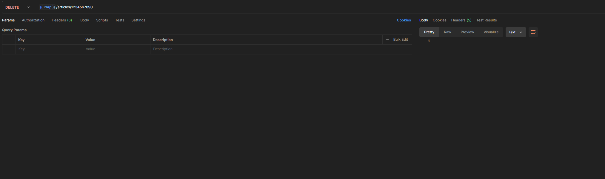
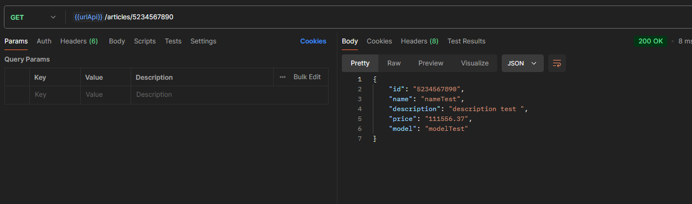
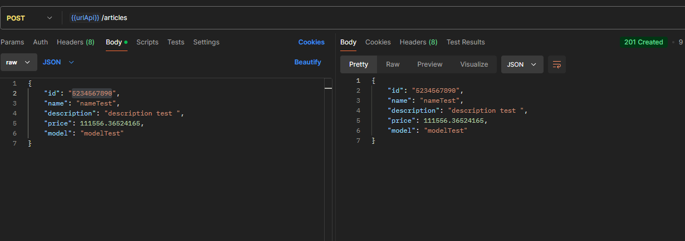
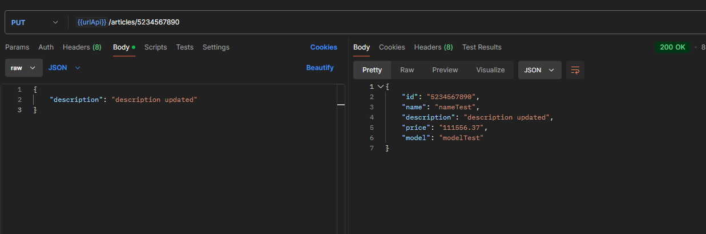
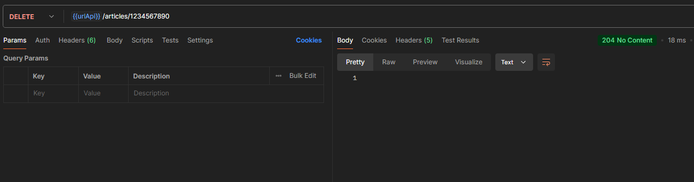

# Proyecto: API CRUD de Artículos

Este proyecto es una API REST que permite realizar operaciones CRUD (Crear, Leer, Actualizar y Eliminar) sobre una tabla de `artículos`, a través del endpoint `/articles/`. Está desarrollado utilizando Node.js con TypeScript, y gestiona la base de datos utilizando **Sequelize** como ORM.

## Endpoints

1. `GET /articles/` - Obtiene todos los artículos.
2. `GET /articles/:id` - Obtiene un artículo por su ID.
3. `POST /articles/` - Crea un nuevo artículo.
4. `PUT /articles/:id` - Actualiza un artículo existente por su ID.
5. `DELETE /articles/:id` - Elimina un artículo por su ID.

### Definición de la API
La documentación de la API se puede visualizar en la ruta [`/api-docs/`](https://speedy-realm-436918-a1.uc.r.appspot.com/api-docs/) del servidor, y está generada utilizando **Swagger UI**.

## Tecnologías Utilizadas

- **Node.js**: Plataforma para ejecutar el servidor backend.
- **TypeScript**: Lenguaje utilizado para escribir código tipado, basado en JavaScript.
- **Sequelize**: ORM para interactuar con bases de datos relacionales.
- **Nodemon**: Herramienta para el reinicio automático del servidor durante el desarrollo.
- **Babel**: Compilador de JavaScript que convierte el código TypeScript/ES6+ a un formato compatible con versiones anteriores de Node.js.

## Requisitos Previos

- Node.js v20+ instalado.
- Cuenta y configuración de servicios en **GCP** o **AWS** (documentados más adelante).
- Base de datos relacional en **Cloud SQL** (GCP) o **RDS** (AWS), configurada y accesible.

## Instalación

1. Clona el repositorio:

   ```bash
   git clone https://github.com/EvyiLdaRkmaN/api-articles.git
   cd proyecto-api-articulos
   ```

2. Instala las dependencias:

   ```bash
   npm install
   ```

3. Configura las variables de entorno en un archivo `.env` (ejemplo incluido en el proyecto como `.env`):

   ```
   PORT=3000
   DB_HOST=34.69.251.59
   DB_NAME=store
   DB_USER=root
   DB_PASSWORD=']&0&_oGAC.zG07=['
   ```

## Scripts Disponibles

- **Iniciar el servidor en desarrollo**:

  ```bash
  npm run dev
  ```

  Este comando utiliza `nodemon` para reiniciar el servidor automáticamente en caso de cambios en el código.

- **Compilar el proyecto**:

  ```bash
  npm run build
  ```

  Compila el código TypeScript a JavaScript utilizando Babel.

- **Iniciar el servidor en producción**:

  ```bash
  npm start
  ```

  Inicia el servidor utilizando el código compilado.

## Servicio en la Nube (GCP)

### Accesible desde Internet con el siguiente enlace

[API CRUD de Artículos](https://speedy-realm-436918-a1.uc.r.appspot.com/articles/)


## evidencia de ejecucion

### Get all articles


### Get article by id


### POST create article


### PUT update article


### DELETE article
